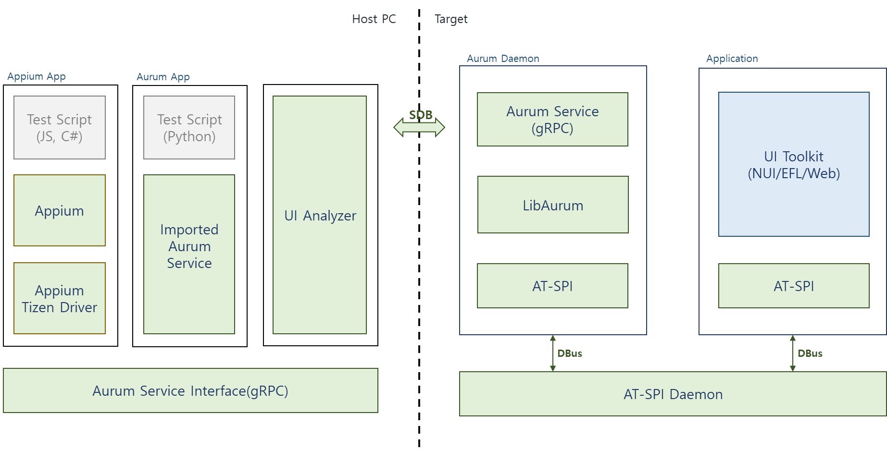

# Introducing Aurum
{: .fs-9 }

- Aurum is a UI automation framework without UI Toolkit dependency.

  Provides Commands to interact with the device UI by simulation user actions and introspection of the screen content.

  It relies on the platform accessibility APIs to introspect the screen.

- User can use the IDL defined in Proto to create an automation app or script in a variety of languages without a language dependency.

Please refer [grpc](https://grpc.io/) and [proto buffers](https://developers.google.com/protocol-buffers) for more information
